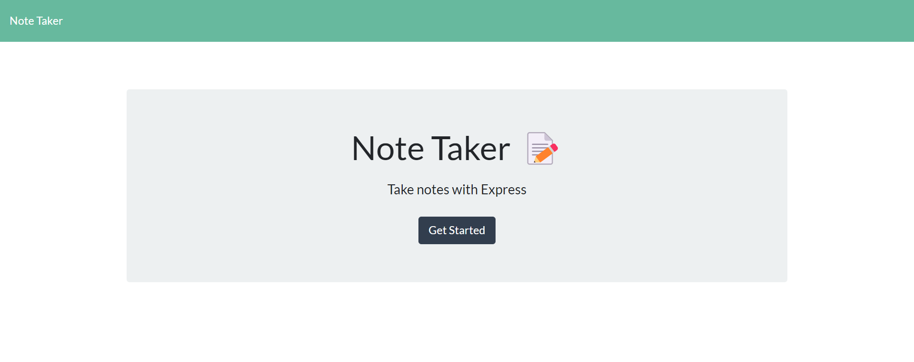
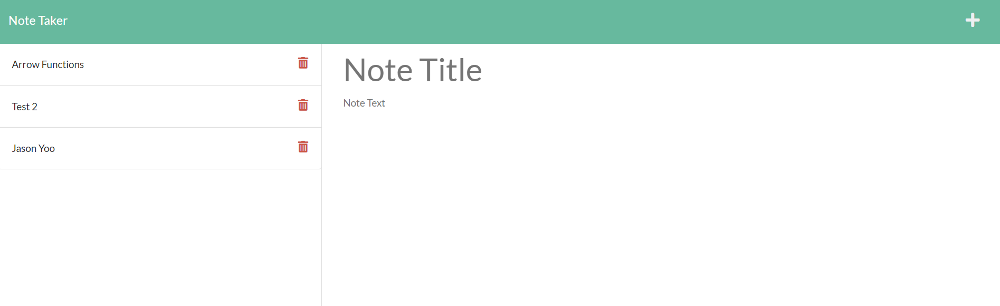
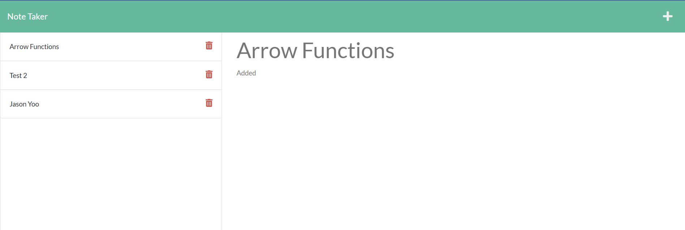
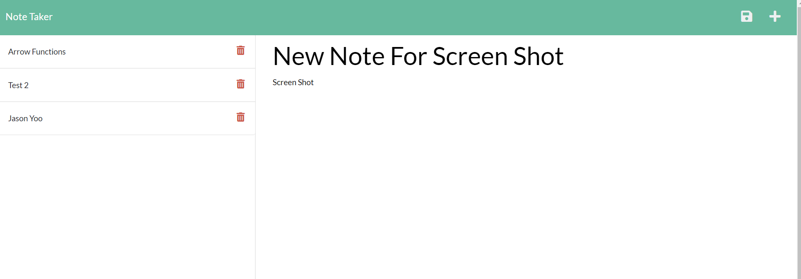
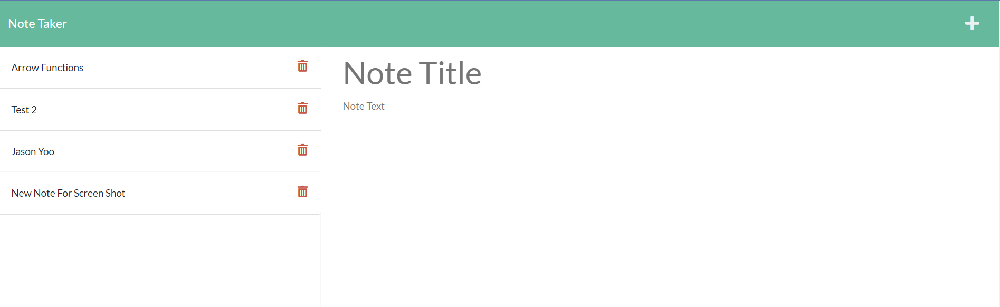
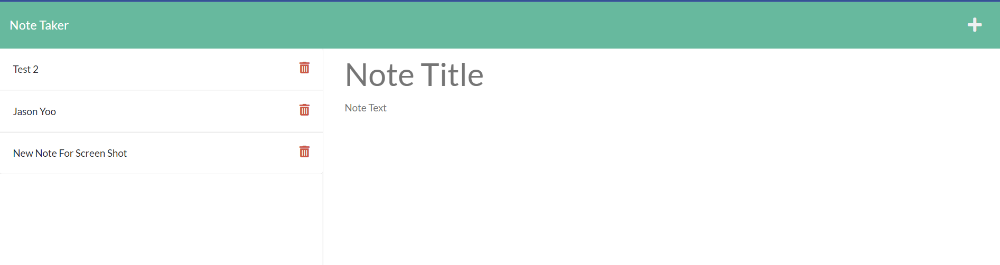

# Note-Taker

(Homework-11: Express.js: Note Taker)

   

   

## Description:

Create an application called Note Taker that can be used to write and save notes. Using Express.js as the backend, the application must save and retrieve nbote data from the JSON file. The applications front end has already been created, therefore the back end must be created by yours truly and connected to the exisiting front end, then the application must be deployed via Heroku.

   
   

## Table of contents:

- [License](#license)
- [Heroku](#heroku)
- [Installation](#installation)
- [Usage](#usage)
- [Contributions](#contributions)
- [Tests](#tests)
- [Credits](#credits)
- [Author](#author)
- [Questions](#questions)

   
   
  
## License:
   
      -  MIT License - Copyright (c) 2022 Jason Yoo

   
   

## Heroku:

https://afternoon-lowlands-55071.herokuapp.com/

    
   

## Installation:

   
      -  Clone files from my github repository provided below || or || click on the link above to use application directly.

   
   
  
  ## Usage: screenshots - (Highlighted Title(s) = a hyperlink to the direct image)

   

Once downloaded, open the file in VS Code || or || click on link above to use application directly.

   

[Screenshot1](images/Screenshot1.png) "Note Taker Landing Page with Get Started Button"

[Screenshot2](images/Screenshot2.png) "Note Taker page with three pre-created notes"

 

[Screenshot3](images/Screenshot3.png) "Note Taker page looking at the first note, the arrow functions note"

 

[Screenshot4](images/Screenshot4.png) "Screenshot of new note being created (before being saved)"

 

[Screenshot5](images/Screenshot5.png) "Screenshot of new note created and saved"

 

[Screenshot5](images/Screenshot6.png) "Screenshot of the first note (arrow functions) having been deleted"

 
 

## Contributions:

   
  Reach me at my email provided below to be added as a contributor.

   
   
  
## Tests: 
   
  npm init -y, npm install, and npm install express. Click on Heroku deployed live app provided above.
  
   
   

## Credits:

   
  Great Thanks to the tutorials provided by Mr. Kevin Sun. It was instrumental in helping me understand the express concepts. Great Thanks to my instructors Jackie Tseng and Dave Cox.

   
   

## Author:

   
  Jason Yoo
  
   
   

## Questions:

For any questions regarding this application, you may reach me directly at jasonjayoo@outlook.com.

To view my other applications, please check out my github page [jasonjayoo](https://github.com/jasonjayoo).
